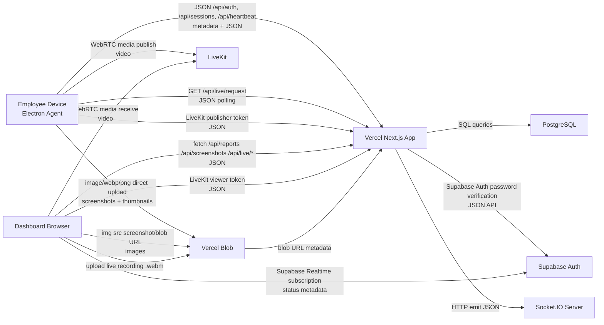

# System Cost Analysis

## Scope
This report is derived from the repository state on 2026-07-29. It does not modify production code. Findings below are separated into `Confirmed` and `Assumptions`.

## Correction
The first draft overstated screenshot-size scenarios by using placeholder values up to `500 KB`. That was not aligned with the current agent implementation. The confirmed code path captures at `1280x720`, compresses to WebP at quality `62`, creates a `360x203` WebP thumbnail at quality `38`, and logs compressed byte sizes in the agent. The model is now updated to use `30 KB`, `45 KB`, and `60 KB` primary screenshot scenarios plus a smaller thumbnail overhead assumption.

## Current Architecture Summary
### Confirmed
- Web app: Next.js App Router app deployed to Vercel from [`app/`](../app), with middleware in [`middleware.ts`](../middleware.ts) and API routes under [`app/api`](../app/api).
- Backend/API: same Next.js deployment handles auth, reports, screenshots, live-view request orchestration, blob upload authorization, and cron execution.
- Desktop agent: Electron app under [`agent/`](../agent) captures screenshots, heartbeats, device/security telemetry, and LiveKit publishing.
- Database: PostgreSQL via `pg` pool in [`lib/db.ts`](../lib/db.ts); schema/migrations implemented in [`scripts/migrate.js`](../scripts/migrate.js).
- Authentication: Supabase Auth validates passwords in [`app/api/auth/route.ts`](../app/api/auth/route.ts); app issues its own JWT via [`lib/auth.ts`](../lib/auth.ts).
- Storage:
  - Current screenshot and live-recording path uses Vercel Blob direct uploads authorized by [`app/api/blob/client-upload/route.ts`](../app/api/blob/client-upload/route.ts).
  - Legacy Supabase storage compatibility still exists in deletion/retention code in [`app/api/screenshots/route.ts`](../app/api/screenshots/route.ts) and [`lib/screenshot-retention.ts`](../lib/screenshot-retention.ts).
- Real-time:
  - Separate Socket.IO server in [`server/socket-server.js`](../server/socket-server.js) receives backend emits from [`lib/socket.ts`](../lib/socket.ts).
  - Dashboard status also subscribes to Supabase Realtime in [`app/(dashboard)/dashboard/page.tsx`](../app/%28dashboard%29/dashboard/page.tsx).
  - Live viewing uses LiveKit tokens/rooms from [`lib/livekit.ts`](../lib/livekit.ts), with polling request coordination in [`app/api/live/request/route.ts`](../app/api/live/request/route.ts).
- Cron jobs: Vercel cron hits `/api/cron/screenshot-retention` daily at `00:15` via [`vercel.json`](../vercel.json).
- Monitoring/logging:
  - Backend uses `console.*` logging in hot paths.
  - Agent writes local file logs (`agent-debug.log`) in [`agent/src/main.ts`](../agent/src/main.ts).
  - No Prometheus/Grafana/OpenTelemetry code is present.
- CI/CD:
  - GitHub workflow directory exists, but no active workflow file was found in the repo listing.
  - Deployment docs target Vercel + Neon in [`DEPLOY.md`](../DEPLOY.md).

### Assumptions
- Current managed Postgres is likely Neon because deployment docs say so, but code only confirms generic Postgres.
- LiveKit is externally hosted; repository does not include a self-hosted LiveKit deployment.
- Separate Socket.IO server hosting is required outside Vercel because `server/socket-server.js` is not a Vercel function.

## Mermaid Diagram

## Confirmed Architecture Details
| Component | Where it runs | Talks to | Data types |
|---|---|---|---|
| Next.js app | Vercel | Postgres, Supabase Auth, Vercel Blob, Socket.IO server, LiveKit | JSON, SQL, blob metadata |
| Electron agent | Employee desktop | Vercel app, Vercel Blob, LiveKit | JSON, images, thumbnails, video |
| Dashboard | Browser | Vercel app, Blob URLs, Supabase Realtime, LiveKit | JSON, images, video |
| Socket.IO server | Separate Node server | Backend and connected browsers/agents | JSON metadata/events |
| Screenshot storage | Vercel Blob | Agent uploads and browser downloads | images |
| Postgres | External managed/self-hosted DB | Next.js only | SQL rows |

## Real Cost Drivers In Code
### Top 10 Confirmed Cost Risks
| Severity | File | Function / route | Current behavior | Cost impact | Metric hit | Recommended fix | Savings | Effort |
|---|---|---|---|---|---|---|---|---|
| Critical | `agent/src/main.ts` | `startTracking` | Captures one screenshot every 5 seconds for full workday. | Creates very high image count, blob writes, commit requests, DB rows, dashboard image transfer. | Blob ops, storage, transfer, DB writes, Vercel invocations | Raise interval or policy-drive dynamic cadence by role/activity. | Very High | Medium |
| Critical | `app/(dashboard)/screenshots/page.tsx` | preview grid/modal | Browser loads thumbnails from Blob, then often full image via `preview` URL. | Every screenshot view adds direct download cost; full-size preview multiplies egress. | Blob transfer, browser bandwidth | Use lower-res preview, signed access, lazy modal fetch, cache headers. | Very High | Medium |
| High | `app/api/agent/screenshots/commit/route.ts` | `POST` | Every 60s batch inserts up to 30 screenshots and emits one `new-screenshot` event per item. | High invocation rate plus socket fan-out; admin dashboards amplify event traffic. | Function invocations, socket server load, DB writes | Batch socket notifications or emit latest-only summary. | High | Small |
| High | `app/api/blob/client-upload/route.ts` | `POST` | Every screenshot batch requires backend token generation and completion logging. | Adds hot-path function calls even though file bytes bypass Vercel functions. | Function invocations, CPU, logs | Issue longer-lived scoped upload credentials or multi-upload tokens. | High | Medium |
| High | `app/api/screenshot-flags/route.ts` | `saveFlaggedScreenshotToBlob` | Backend fetches original screenshot from storage and re-uploads flagged copy to Blob. | Causes storage-to-Vercel-to-storage double transfer and duplicate storage. | Origin transfer, blob transfer, storage | Copy by storage-native operation or store metadata reference only. | High | Medium |
| High | `app/api/live/agents/route.ts` | `GET` | Live monitor refreshes every 15s and runs CTEs across attendance, employee_status, latest screenshots, plus possible alert inserts. | Repeated broad reads for each admin viewer. | Function invocations, DB CPU, reads | Add server-side cache/windowed polling and precomputed online-state table. | High | Medium |
| High | `app/api/reports/route.ts` | `getDailyReportData` | Report query uses multiple correlated subqueries and large screenshot scans. | Dashboard auto-refresh repeatedly recomputes daily rollups. | DB CPU, function CPU | Materialize daily aggregates or precompute per attendance. | High | Large |
| Medium | `middleware.ts` | global matcher | Middleware runs on most non-static routes including API requests. | Adds edge request overhead to hot API traffic. | Edge requests, edge CPU | Exclude API routes if headers/security checks are not needed there. | Medium | Small |
| Medium | `app/(dashboard)/dashboard/page.tsx` | `setInterval(fetchData)` | Admin refreshes reports every 60s; client every 15s even with Supabase Realtime already active. | Polling duplicates DB/report load. | Function invocations, DB reads | Reduce polling or switch to event-triggered refresh. | Medium | Small |
| Medium | `agent/src/main.ts` | telemetry/policy/scan intervals | Multiple 2s/5s/15s/20s loops run continuously. | Local CPU/battery cost and steady API/event potential when features expand. | Desktop CPU, support burden | Consolidate timers and gate scans by policy/device state. | Low | Medium |

### Additional Confirmed Findings
| Severity | File | Function / route | Current behavior | Why it increases cost | Metric hit | Recommended fix | Savings | Effort |
|---|---|---|---|---|---|---|---|---|
| High | `app/api/reports/route.ts` | employee/client daily report SQL | Repeated `SELECT MAX(...)` correlated subqueries per attendance. | Can degrade with screenshot/break growth. | DB CPU | Precompute `session_last_activity`. | High | Large |
| High | `app/api/live/request/route.ts` + `app/(dashboard)/live/page.tsx` | request polling | Viewer polls every 2.5s up to 70s waiting for agent. | Repeated short-interval request churn during each connect attempt. | Function invocations | Replace with socket/WebSocket acknowledgment. | High | Medium |
| Medium | `app/api/live/agents/route.ts` | silent-device insert branch | A GET route can write `device_alerts`. | Background work inside read path increases latency/cost. | DB writes, CPU | Move alert generation to scheduled worker. | Medium | Medium |
| Medium | `app/api/screenshots/route.ts` | `GET` | Default admin path can query full history with no default date filter. | Expensive scans become more likely as table grows. | DB reads | Default to recent window and require explicit range. | Medium | Small |
| Medium | `app/api/screenshots/route.ts` | `GET` | Uses `ILIKE` on `active_app` without a specialized index. | App-name filtering will scan more data over time. | DB CPU | Add trigram or lower(active_app) search index if needed. | Medium | Medium |
| Medium | `scripts/migrate.js` | indexes | `screenshots(employee_id)` and `screenshots(captured_at)` exist, but not `(employee_id, captured_at DESC)`. | Common screenshot queries filter by employee and sort by capture time. | DB CPU | Add composite indexes for main access patterns. | Medium | Small |
| Medium | `scripts/migrate.js` | indexes | No index on `attendance(check_out)` or `(employee_id, check_out, check_in DESC)`. | Open-session lookups are frequent. | DB CPU | Add partial/open-session indexes. | Medium | Small |
| Low | `app/api/blob/client-upload/route.ts` | logging | Logs token request and completion for every batch/recording upload. | Log growth is linear with screenshot volume. | Log ingestion/storage | Sample or reduce hot-path logs. | Low | Small |
| Low | `app/api/cron/screenshot-retention/route.ts` | retention cron | Daily cleanup force-runs even though library already has min-run logic. | Not large now, but can become chunky delete batch. | DB I/O, blob deletes | Keep, but monitor delete batch durations. | Low | Small |

## Code To Vercel Usage Map
| Vercel metric | Responsible code paths |
|---|---|
| Edge Requests | `middleware.ts` on most dynamic/app/api routes. |
| Additional Edge CPU | `hasSuspiciousQueryPayload` checks in `middleware.ts` for every matched request. |
| Function Invocations | All `app/api/**/route.ts`, especially `/api/heartbeat`, `/api/blob/client-upload`, `/api/agent/screenshots/commit`, `/api/reports`, `/api/live/agents`, `/api/live/request`. |
| Fast Data Transfer | JSON API responses from reports/screenshots/live endpoints to browsers and agents. |
| Fast Origin Transfer | High-risk when backend fetches blob assets then returns/stores something derived, e.g. screenshot flagging flow. |
| Fluid Active CPU / Provisioned Memory | Heavy SQL/report endpoints and blob token handlers if deployed on Vercel Fluid. |
| ISR Reads | None confirmed; no ISR or `revalidate` logic found. |
| Image Optimization Transformations | `next/image` is used for brand assets; screenshot pages use raw ``, so screenshot viewing does not currently hit Next image optimization. |
| Image Optimization Cache Reads/Writes | Not a screenshot driver in current code. |

### Confirmed Double-Transfer Paths
1. `Blob -> Vercel function -> Blob`
   - [`app/api/screenshot-flags/route.ts`](../app/api/screenshot-flags/route.ts)
   - `saveFlaggedScreenshotToBlob()` fetches original screenshot from blob URL, buffers it in the function, then `put()` uploads a duplicate blob.
2. `Blob -> Browser` direct
   - [`app/(dashboard)/screenshots/page.tsx`](../app/%28dashboard%29/screenshots/page.tsx)
   - [`app/(dashboard)/live/page.tsx`](../app/%28dashboard%29/live/page.tsx)
   - This is correct for direct delivery, but it is the dominant download cost path.

## Code-Derived Usage Model
### Confirmed interval values
- Screenshot capture: `5s`
- Screenshot upload batch: `60s`
- Heartbeat: `30s`
- Dashboard refresh: `60s` admin, `15s` client
- Live monitor refresh: `15s`
- Viewer heartbeat: `20s`
- Screenshot retention: `3 days`

### Confirmed screenshot encoding path
- Capture target size: `1280x720` in [`agent/src/main.ts`](../agent/src/main.ts)
- Primary upload format: WebP when smaller than PNG
- Primary WebP quality: `62`
- Thumbnail size: `360x203`
- Thumbnail WebP quality: `38`
- Agent logs `originalBytes`, `finalBytes`, and `thumbnailBytes` for each capture in [`agent/src/main.ts`](../agent/src/main.ts)

### Formulas
- Work seconds/day = `9 * 3600 = 32,400`
- Screenshots/employee/day = `32,400 / 5 = 6,480`
- Screenshots/employee/month = `6,480 * 22 = 142,560`
- Heartbeats/employee/day = `32,400 / 30 = 1,080`
- Heartbeats/employee/month = `1,080 * 22 = 23,760`
- Screenshot batch commits/employee/day = `32,400 / 60 = 540`
- Screenshot upload volume/month = `total screenshots * (image size + thumbnail size)`
- Thumbnail assumption in revised model = `12%` of full image
- Screenshot download volume/month = `total screenshots * views per screenshot * image size`
- Live view minutes/month = `employees * 9 * 60 * 22 * live_view_pct`

### Monthly Usage By Employee Count
Using 45 KB screenshots, 12% thumbnail overhead, 1 view per screenshot, live view at 5%.

| Employees | Screenshots / month | Upload GB / month | Download GB / month | Heartbeats / month | Commit requests / month | Live minutes / month |
|---|---:|---:|---:|---:|---:|---:|
| 10 | 1,425,600 | 66.84 | 61.18 | 237,600 | 118,800 | 5,940 |
| 30 | 4,276,800 | 200.52 | 183.53 | 712,800 | 356,400 | 17,820 |
| 50 | 7,128,000 | 334.20 | 305.89 | 1,188,000 | 594,000 | 29,700 |
| 100 | 14,256,000 | 668.39 | 611.78 | 2,376,000 | 1,188,000 | 59,400 |
| 500 | 71,280,000 | 3,341.96 | 3,058.98 | 11,880,000 | 5,940,000 | 297,000 |

### Storage Growth By Employee Count
Using 3-day retention and 45 KB screenshots with 12% thumbnails.

| Employees | Steady-state screenshot storage GB |
|---|---:|
| 10 | 9.11 |
| 30 | 27.34 |
| 50 | 45.57 |
| 100 | 91.14 |
| 500 | 455.68 |

### Database Row Growth
Approximate confirmed row drivers from implemented writes.

| Employees | Screenshot rows / month | Heartbeat upserts / month | Batch status upserts / month | Total write operations / month |
|---|---:|---:|---:|---:|
| 10 | 1,425,600 | 475,200 | 118,800 | 2,019,600 |
| 30 | 4,276,800 | 1,425,600 | 356,400 | 6,058,800 |
| 100 | 14,256,000 | 4,752,000 | 1,188,000 | 20,196,000 |
| 500 | 71,280,000 | 23,760,000 | 5,940,000 | 100,980,000 |

## Cost By Feature
| Feature | Requests | DB reads | DB writes | Storage | Transfer | Notes |
|---|---|---|---|---|---|---|
| Auth | Low | profile lookup | none | none | low | Supabase password verify + app JWT |
| Check-in/out | Low | open attendance lookups | attendance + status updates | none | low | Burst at shift boundaries |
| Heartbeats | Very high | none | `employee_status` + `device_registrations` upserts | none | low | One POST every 30s/employee |
| Activity monitoring | Low currently | none | mostly status bump only | none | low | `activity_events` table exists but current route avoids using it |
| Screenshot capture | Very high | none | screenshot rows | very high | very high | Primary cost center |
| Screenshot upload | Very high | none | metadata save | very high | upload egress from agent | Direct blob upload is good, but volume is huge |
| Screenshot display | Medium to very high | metadata query | none | none | very high | Blob egress dominates on review-heavy teams |
| Screen recording | Medium | metadata only | currently minimal | high | high | Live recording upload path exists |
| Live screen viewing | Medium | request/status checks | request heartbeat/status updates | none | very high | LiveKit cost external to Vercel |
| Dashboard loading | Medium/high | report SQL | none | none | medium | Recomputed often |
| Reports | Medium | heavy SQL | export logs | none | medium | CPU-heavy DB path |
| Notifications/alerts | Low | low | alert rows | none | low | Some writes happen inside GET/live paths |
| AI API usage | None confirmed | none | none | none | none | No AI API integration found |
| Scheduled jobs | Low | delete scans | delete rows | deletes storage | low | screenshot retention only |
| Logs/monitoring | Medium | none | none | log storage | low | Hot-path console logs present |

## Database Analysis
### High-growth tables
- `screenshots`: dominant row growth.
- `attendance`: one or more rows per employee/day.
- `breaks`: growth depends on usage pattern.
- `device_registrations`: low growth, high update frequency.
- `device_alerts`: moderate growth if silent-device logic triggers often.
- `screenshot_flags`: lower growth, but stores duplicate blob evidence.

### Existing indexes confirmed
- `idx_screenshots_employee`
- `idx_screenshots_time`
- `idx_screenshot_flags_screenshot`
- `idx_sessions_user`
- `idx_recordings_employee`
- `idx_app_activity_employee`
- `idx_activity_events_employee`
- `idx_breaks_attendance`
- `idx_attendance_employee`
- `idx_device_events_device_time`
- `idx_device_alerts_device_time`
- `live_view_requests_employee_status_idx`

### Likely missing indexes
- `screenshots (employee_id, captured_at DESC)`
- `screenshots (session_id, captured_at DESC)`
- `attendance (employee_id, check_out, check_in DESC)` or partial open-session index
- `breaks (attendance_id, end_time)`
- `employee_status (last_activity)` if stale scans become frequent

### Unbounded or expensive query patterns
- Screenshot admin view can default to full-history query.
- Reports endpoint recomputes daily aggregates by scanning screenshots within day window.
- Client report path uses correlated subqueries per attendance row.
- `ILIKE` active app filtering lacks supporting index.

### Connection behavior
- One `pg.Pool` is created in-process in [`lib/db.ts`](../lib/db.ts) without explicit pool size tuning or external pooling config.
- For serverless/function environments this increases pressure for connection pooling.
- Recommendation: put PgBouncer/Neon pooled connection string in front of Vercel functions before scale.

### Partitioning
- Not justified immediately at current unknown production scale.
- At projected 100 employees, `screenshots` exceeds 14M new rows/month and becomes a strong candidate for monthly partitioning or archival after retention redesign.

## Current Versus Recommended Architecture
| Area | Current | Recommended |
|---|---|---|
| Web/API hosting | Next.js on Vercel | Node.js backend on VPS |
| Database | Postgres, likely managed | Managed Postgres or dedicated DB server |
| Screenshot storage | Vercel Blob | Cloudflare R2 |
| Screenshot upload | Direct blob upload + metadata commit | Keep direct upload, switch target to R2 |
| Screenshot viewing | Direct public blob URLs in browser | Backend-issued short-lived signed R2 URLs |
| Live view control | Polling + LiveKit | LiveKit kept, replace polling with socket/event flow where possible |
| Real-time events | Separate Socket.IO server + Supabase Realtime | Keep one real-time path; avoid duplicate mechanisms |
| Retention | 3-day screenshot cleanup | Policy-driven retention with archival/deletion controls |
| Monitoring | Console logs | Prometheus + Grafana + structured logs |

## Target Architecture Recommendation
### Recommended target
- Cloudflare DNS/WAF in front of public services.
- Node.js API on VPS.
- PostgreSQL on separate managed service or separate VPS.
- Cloudflare R2 for screenshots and recordings.
- Direct presigned upload from agent to R2.
- Signed short-lived download URLs for dashboard viewing.
- Background worker for retention cleanup, alert generation, and aggregation.
- LiveKit for live viewing.
- Docker Compose for initial deployment.
- Prometheus + Grafana + automated backups.
- Separate staging and production stacks.

### Current code paths that must change
- [`app/api/blob/client-upload/route.ts`](../app/api/blob/client-upload/route.ts): replace Vercel Blob token generation with R2 presign service.
- [`app/api/agent/screenshots/commit/route.ts`](../app/api/agent/screenshots/commit/route.ts): validate R2 object keys instead of Vercel Blob paths.
- [`app/(dashboard)/screenshots/page.tsx`](../app/%28dashboard%29/screenshots/page.tsx): stop rendering raw public blob URLs; request signed download URL or API tokenized asset URL.
- [`app/(dashboard)/live/page.tsx`](../app/%28dashboard%29/live/page.tsx): live recording upload target should move from Vercel Blob to R2.
- [`app/api/screenshot-flags/route.ts`](../app/api/screenshot-flags/route.ts): replace re-fetch/re-upload duplication with object copy or metadata reference.
- [`lib/screenshot-retention.ts`](../lib/screenshot-retention.ts): delete against R2 and add retention policies beyond screenshot-only cleanup.

## Deployment Architecture Comparison
Provider prices are intentionally left `null` in [`docs/cost-model.json`](../docs/cost-model.json) because the repository does not contain authoritative current price sheets.

| Option | Fixed cost | Variable cost | Op complexity | Vendor lock-in | Notes |
|---|---|---|---|---|---|
| Current | Unknown from code | High screenshot/storage transfer sensitivity | Medium | Medium/high | Vercel is convenient but screenshot-heavy workloads are expensive |
| Option A Oracle VPS + PG VPS + R2 + LiveKit | Needs provider rates | R2 + LiveKit dependent | Medium/high | Low/medium | Lowest software stack cost if ops burden acceptable |
| Option B Hetzner VPS + managed PG + R2 + LiveKit | Needs provider rates | R2 + LiveKit dependent | Medium | Low/medium | Good cost/control balance |
| Option C DO Droplet + managed PG + R2 | Needs provider rates | R2 dependent | Medium | Medium | Simpler managed DB, slightly more lock-in |
| Option D Railway/Render + Neon/Supabase + R2 | Needs provider rates | Runtime + DB + R2 | Low/medium | Medium/high | Easiest migration path, less savings than VPS |

## Optimization Roadmap
### Immediate: 1-3 days
| Recommendation | Affected files | Cost impact | Perf impact | Effort | Risk | Verification | Rollback |
|---|---|---|---|---|---|---|---|
| Increase screenshot interval or make it policy-driven | `agent/src/main.ts` | Very High | Lower device/network load | Medium | Medium | Compare screenshot volume/day before/after | restore previous interval |
| Reduce dashboard polling where Realtime exists | `app/(dashboard)/dashboard/page.tsx` | Medium | Lower DB/API load | Small | Low | Observe fewer `/api/reports` calls | restore previous timers |
| Exclude API routes from middleware if safe | `middleware.ts` | Medium | Lower edge overhead | Small | Medium | Security regression check + request counts | revert matcher |
| Cut hot-path screenshot upload logs | `app/api/blob/client-upload/route.ts`, `app/api/agent/screenshots/commit/route.ts` | Low | Lower log volume | Small | Low | Log ingest size | restore logs |

### Short term: 1-2 weeks
| Recommendation | Affected files | Cost impact | Perf impact | Effort | Risk | Verification | Rollback |
|---|---|---|---|---|---|---|---|
| Add composite screenshot and attendance indexes | `scripts/migrate.js` | Medium | Better DB latency | Small | Low | `EXPLAIN ANALYZE` on hot queries | revert migration |
| Replace live request polling with socket acknowledgement | `app/api/live/request/route.ts`, `app/(dashboard)/live/page.tsx`, `agent/src/main.ts`, `server/socket-server.js` | High | Faster live connect | Medium | Medium | count request drop during connect | keep polling fallback |
| Precompute or cache report aggregates | `app/api/reports/route.ts` | High | Faster dashboard | Large | Medium | report latency and DB CPU | keep old query path behind flag |
| Eliminate screenshot flag re-download/re-upload | `app/api/screenshot-flags/route.ts` | High | Faster flagging | Medium | Low | transfer logs | keep duplicate path temporarily |

### Medium term: 1-2 months
| Recommendation | Affected files | Cost impact | Perf impact | Effort | Risk | Verification | Rollback |
|---|---|---|---|---|---|---|---|
| Migrate screenshot and recording storage to R2 | blob routes, dashboard image consumers, retention code | Very High | Better storage economics | Large | Medium | compare storage+egress bill | dual-write then cut over |
| Move API off Vercel to VPS | deployment/config/runtime files | High | More predictable cost | Large | Medium/high | load test and cost compare | retain Vercel standby |
| Add background worker for alerts, retention, aggregates | report/live/retention paths | Medium | Lower request latency | Medium | Medium | no writes from GET routes | keep in-request fallback briefly |
| Add Prometheus/Grafana and backup automation | deployment/ops | Medium | Better reliability | Medium | Low | dashboards + restore drills | disable stack |

### Long term
- Partition or archive screenshot metadata only if retention or compliance requires more than short-window storage.
- Consider service extraction only after VPS monolith metrics show real bottlenecks.
- Kubernetes is not justified by this repository’s current architecture.

## Unknowns Blocking Exact Estimate
| Unknown | Why it matters |
|---|---|
| Actual provider price sheets and plan tiers | Required for exact dollar totals |
| Real screenshot compression output distribution | Strongly affects upload/storage/download size |
| Number of simultaneous dashboard viewers | Drives screenshot and report download cost |
| Real live-view session frequency and average duration | Drives LiveKit and recording cost |
| Production DB provider and connection limits | Affects pooling recommendations |
| Whether screenshots are viewed once or repeatedly | Major egress multiplier |
| Whether current deployment still uses public Vercel Blob URLs in prod | Affects cacheability and security design |

## Current Architecture Suitability
For a real production time-tracking platform with screenshot-heavy monitoring, the current architecture is functional but still cost-sensitive at moderate scale. After correcting the screenshot-size assumption downward, the primary risk is still the `5-second` capture cadence combined with repeated dashboard/report polling and screenshot-centric review flows. Even with `30-60 KB` screenshots, the screenshot count itself is so high that metadata growth, blob operations, and review egress remain material at 100+ employees unless cadence, storage target, query strategy, and polling model are changed.
